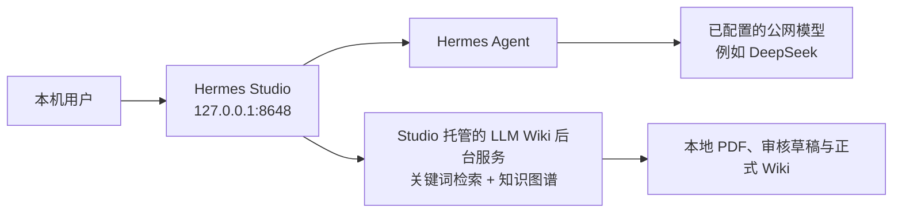

# NanWangAgent / AGNET 本地智能工作台

AGNET 是面向个人研究与日常工作的 Windows 本地智能工作台。它不重新实现 Agent 核心，而是在固定版本的 Hermes Studio、Hermes Agent 和 LLM Wiki 上增加了论文知识库和记忆管理能力。

本仓库交付的是 **Windows 单用户、仅限 `localhost`、非商用验证原型**。完成本 README 的首次安装后，使用者可以在本机打开 `http://127.0.0.1:8648`，上传论文、审核知识、使用 Hermes 对话、管理记忆。

**Studio 是唯一面向使用者的入口。** 左侧一级导航中的 **LLM Wiki** 是论文知识库的唯一管理入口。LLM Wiki 仍保持独立本机进程以隔离许可证和数据边界，但只作为 Studio 管理的后台知识服务运行，不创建用户可见窗口、托盘图标或独立浏览器入口。

> 不需要安装 Ollama，也不需要执行 `ollama pull bge-m3`。当前知识库固定使用 **关键词检索 + 知识图谱扩展**，不生成 embedding、不运行向量数据库或本地生成模型。

## 产品概览

| 组件 | 固定版本 | 用途 |
| --- | --- | --- |
| Hermes Agent | `0.18.2` | 对话、会话、长期记忆与工具调用运行时 |
| Hermes Studio | `0.6.30`，上游基线 `5be8548` | 本地 Web 工作台、登录、BFF 和业务页面 |
| LLM Wiki | `0.6.4`，上游基线 `03e46fc4` | PDF 解析、审核草稿、正式 Wiki、关键词检索和知识图谱 |



三类数据有明确边界：

- 论文知识只在 LLM Wiki 的审核流程中进入正式知识库；Hermes 的 `research` Profile 只能读取批准后的知识。
- 记忆由当前 Hermes Profile 管理；新会话可选择是否向配置的公网模型发送长期记忆。

## 功能清单

登录后默认进入“个人工作台”。左侧一级导航包括以下功能。

| 入口 | 用法 | 当前交付范围 |
| --- | --- | --- |
| 个人工作台 | 查看今日论文、待审核数、可信知识库规模和服务健康状态 | 已完成 |
| Hermes 对话 | 创建会话、选择 Profile 和记忆模式，使用已配置的模型进行对话 | 已完成；模型密钥需由使用者自行配置 |
| LLM Wiki | 在 Studio 内完成项目创建/切换、论文审核、Wiki 树与编辑、文件历史、页面链接、来源库、检索、知识图谱、审核、对话、深度研究、Skills、检查和设置 | 已完成；检索为关键词 + 图谱，不含向量检索 |
| 记忆管理 | 管理当前 Profile 的 `MEMORY.md`、`USER.md`、`SOUL.md`，查看生效状态、版本和恢复入口 | 已完成 |
| 全部功能 / 高级工具 | 原 Hermes Studio 的 History、Workflow、Jobs、Skills、MCP、Files、Coding Agents、Logs、Models 等 | 原有路由和 API 保留 |

## 数据与安全边界

### 论文知识库

论文必须经过审核才会进入可信库。状态流转如下：

```text
uploaded -> parsing -> drafting -> awaiting_review -> publishing -> trusted
                                      |                 |
                                      +-> revision_requested / rejected / failed
```

- 上传后的 PDF、提取内容和拟发布页面变更先保存在 `.llm-wiki/staging/<draftId>`。
- `awaiting_review`、`revision_requested`、`rejected` 和 `failed` 状态的内容不会写入正式 `wiki/`、`raw/sources/`，也不会被检索、问答或 Hermes 引用。
- 批准时只允许一个草稿进入发布阶段；系统在项目锁中原子发布 PDF、Wiki 页面、索引和图谱变更，失败会回滚。
- 正式引用保留 `EvidenceLocator`，包含来源、修订、页码、章节和片段校验。界面中的页码引用可打开原 PDF 对应页。
- 本地检索优先使用已经批准、自己读过的论文。外部检索只把题录、摘要、链接和推荐理由放入“待读候选箱”，不会自动下载或进入正式 Wiki。

### Hermes 对话与记忆

新建会话时选择一种模式；第一条消息发出后该模式锁定，改用另一种模式必须新建会话。

| 模式 | 行为 | 适用场景 |
| --- | --- | --- |
| 开启长期记忆（`on`） | Hermes 标准记忆行为。`MEMORY.md` 和 `USER.md` 会作为上下文发送给当前配置的公网模型。 | 非敏感的稳定偏好、长期研究背景 |
| 关闭长期记忆（`clean`） | 使用 `skip_memory=True`；不读取或发送 `MEMORY.md`、`USER.md`，不加载 memory 工具、外部 Memory Provider 或 `session_search`。 | 临时、敏感或不希望使用长期偏好的会话 |

`SOUL.md`、用户选择的 Skills 和当前工作区上下文会在两种模式下保留。请只把非敏感偏好和稳定事实写入 `MEMORY.md` / `USER.md`，不要写入密码、密钥、身份证号、客户数据或公司经营数据。

## 安装前准备

### 系统要求

- Windows 10 或 Windows 11 x64，PowerShell 5.1 或更高版本。
- Node.js `>= 23`，推荐 Node.js 24 LTS；安装后 `node --version` 必须返回 `v23` 或更高。
- `pnpm`，可通过 `npm install --global pnpm` 安装。
- Python 和 `py` Launcher，用于创建项目独立的 Hermes 虚拟环境。
- Rust stable、Visual Studio C++ Build Tools（勾选“使用 C++ 的桌面开发”）和 Microsoft Edge WebView2 Runtime，用于构建 LLM Wiki Tauri 本机后台服务。
- Git，以及访问 npm、PyPI 和 Rust 依赖源的网络。

建议安装完成后在新的 PowerShell 窗口中确认：

```powershell
node --version
npm --version
pnpm --version
py --version
rustc --version
```

Ollama、GPU、CUDA、`bge-m3` 都不在本项目的依赖列表中。只有 CPU 的 Windows 机器可以运行当前模式；PDF 数量较多时，解析和图谱更新会受 CPU、内存和磁盘性能影响。

### 获取代码

使用 Git：

```powershell
git clone https://github.com/feifeidu-max/NanWangAgent.git
Set-Location .\NanWangAgent
git checkout main
```

也可以解压交付的源码包后，在仓库根目录打开 PowerShell。以下所有命令均以仓库根目录为工作目录。

## 首次安装

下面的步骤只需在一台新机器上执行一次。不会下载或安装 Ollama。

### 1. 安装固定版本的 Hermes Agent

将 Hermes 安装在仓库自己的虚拟环境中，避免覆盖机器上已有的其他 Hermes 版本：

```powershell
$hermesVenv = Join-Path $PWD ".runtime\hermes-0.18.2"
py -m venv $hermesVenv
& "$hermesVenv\Scripts\python.exe" -m pip install --upgrade "hermes-agent==0.18.2"
& "$hermesVenv\Scripts\hermes.exe" --version
```

最后一条命令必须显示 `0.18.2`。

### 2. 安装并构建 Hermes Studio

```powershell
Set-Location .\apps\hermes-studio
pnpm install --frozen-lockfile
pnpm run build
Set-Location ..\..
```

### 3. 安装并构建 LLM Wiki

```powershell
Set-Location .\apps\llm-wiki
npm ci
npm run tauri build
Set-Location ..\..
```

成功后，默认可执行文件位于：

```text
apps\llm-wiki\src-tauri\target\release\llm-wiki.exe
```

Tauri 首次构建通常需要数分钟，并会下载 Rust/Windows 依赖。如果构建报错，先确认 Rust、Visual Studio C++ Build Tools 和 WebView2 Runtime 均已安装，再重新执行该命令。不要把旧版本的 LLM Wiki 可执行文件当作本仓库的构建产物使用；AGNET 启动器也会拒绝 `target\debug\llm-wiki.exe`，因为它依赖 Vite 开发服务器 `localhost:1420`，不能作为日常 Studio 托管后台服务运行。

### 4. 创建本机配置

复制模板；该文件已经被 Git 忽略，不能提交：

```powershell
Copy-Item .\ops\config.example.psd1 .\ops\config.local.psd1
notepad .\ops\config.local.psd1
```

至少检查或修改以下字段。路径可以是绝对路径，也可以是相对于仓库根目录的路径。仓库位于中文目录时，建议使用下面的相对路径，避免旧版 PowerShell 的编码/路径兼容问题。

```powershell
@{
    HermesExecutable  = ".runtime\hermes-0.18.2\Scripts\hermes.exe"
    LlmWikiExecutable = "apps\llm-wiki\src-tauri\target\release\llm-wiki.exe"

    # 必须与稍后在 Studio 中管理的知识库项目一致。
    WikiProjectPaths = @(
        "%USERPROFILE%\Documents\LLM-Wiki"
    )

    # 确保该盘可写、有足够空间，且不位于 Wiki 项目或 Hermes 数据目录内。
    BackupRoot      = "D:\AGNET-Backups"
    RetentionCount  = 30
    DailyBackupTime = "18:00"
}
```

保留模板中其他配置项不变即可。`HermesHome` 留空时，Studio 按 Windows 默认位置自动发现。

### 5. 创建 LLM Wiki API Token

Token 仅写入当前 Windows 用户环境变量，**不要**写进 `config.local.psd1`、`.env`、聊天、Wiki、日志或 README。以下命令会生成 32 字节随机 Token，并同时写入当前 PowerShell：

```powershell
$bytes = New-Object byte[] 32
$rng = [Security.Cryptography.RandomNumberGenerator]::Create()
$rng.GetBytes($bytes)
$rng.Dispose()
$token = [Convert]::ToBase64String($bytes)
[Environment]::SetEnvironmentVariable("AGNET_LLM_WIKI_API_TOKEN", $token, "User")
$env:AGNET_LLM_WIKI_API_TOKEN = $token
Remove-Variable token, bytes
```

关闭并重新打开 PowerShell 后，用户环境变量会自动生效。启动器会把它临时映射为 LLM Wiki 所需的 `LLM_WIKI_API_TOKEN`，并只传给 LLM Wiki MCP 子进程。

### 6. 配置知识库项目和可选问答模型

Studio 是唯一用户入口。LLM Wiki 会由启动器以无用户可见窗口、无托盘图标的后台服务运行；不要单独启动 `llm-wiki.exe` 或访问 `19828` 端口。

先创建 `WikiProjectPaths` 中配置的项目目录。例如：

```powershell
New-Item -ItemType Directory -Force "$env:USERPROFILE\Documents\LLM-Wiki" | Out-Null
```

启动器会注册 `WikiProjectPaths` 中的项目，也会自动发现 Studio 新建的受控项目。只有一个存在的路径时会自动选为当前项目。存在多个项目时，从 Studio 左侧的“LLM Wiki”一级入口顶部切换或新建项目；不需要打开独立 LLM Wiki。Studio 新建的项目默认保存在 `LlmWikiManagedProjectsHome`，会自动进入启动注册、每日备份和恢复白名单。

论文上传、严格审核、关键词检索和知识图谱使用后台确定性流程，不要求模型凭据。若要使用 Studio 内的 Wiki 问答，为 LLM Wiki 设置获批准的模型环境变量；例如 DeepSeek 的 OpenAI 兼容端点：

```powershell
[Environment]::SetEnvironmentVariable("LLM_WIKI_LLM_PROVIDER", "custom", "User")
[Environment]::SetEnvironmentVariable("LLM_WIKI_LLM_MODEL", "deepseek-chat", "User")
[Environment]::SetEnvironmentVariable("LLM_WIKI_LLM_CUSTOM_ENDPOINT", "https://api.deepseek.com/v1", "User")

$secureKey = Read-Host "LLM Wiki model API key" -AsSecureString
$pointer = [Runtime.InteropServices.Marshal]::SecureStringToBSTR($secureKey)
try {
    $plainKey = [Runtime.InteropServices.Marshal]::PtrToStringBSTR($pointer)
    [Environment]::SetEnvironmentVariable("LLM_WIKI_LLM_API_KEY", $plainKey, "User")
    $env:LLM_WIKI_LLM_API_KEY = $plainKey
} finally {
    [Runtime.InteropServices.Marshal]::ZeroFreeBSTR($pointer)
}
Remove-Variable secureKey, pointer, plainKey -ErrorAction SilentlyContinue
```

重新打开 PowerShell 后，启动器会把这些变量交给后台服务。密钥不写入仓库、本地配置、Wiki 或备份；Studio 的“LLM Wiki / 设置”会显示问答模型是否可用。

### 7. 启动工作台并完成首次登录

```powershell
.\Start-AGNET.cmd
```

启动器会依次：校验版本、初始化 `research` Profile、以无用户可见窗口的后台模式启动 LLM Wiki、检查 Token 与回环监听、启动 Studio，然后打开唯一的用户入口：

```text
http://127.0.0.1:8648
```

首次账户为 `admin / 123456`。首次登录必须按页面提示修改默认密码；不要在共享机器上保留默认密码。登录会话有效期固定为 12 小时。

### 8. 配置 Hermes 对话模型

本仓库不会附带 DeepSeek 或任何公网模型的 Key。登录后从“全部功能 / 高级工具”进入 Models/Providers，按照组织批准的模型端点配置 Hermes 对话模型和凭据。Wiki 问答使用上一节的 `LLM_WIKI_LLM_*` 环境变量；本地工作台、论文审核、关键词检索和图谱不依赖公网模型。

## 每日使用指南

### 知识库整理完整操作手册

下面从启动开始描述一次完整的“论文 PDF → 待审核草稿 → 正式 Wiki → 检索/图谱 → Hermes 引用”流程。界面按钮名称均按当前中文界面书写。

#### 第 1 步：启动并登录

1. 在项目根目录双击 `Start-AGNET.cmd`。保持弹出的启动窗口开启，等待浏览器打开 `http://127.0.0.1:8648`。
2. 在登录页依次点击“用户名”和“密码”输入框，输入当前管理员账号与密码。
3. 点击“登录”。首次使用默认账号时，按页面要求先修改默认密码，然后重新登录。
4. 登录后检查左侧一级导航，应看到“个人工作台”“Hermes 对话”“LLM Wiki”“记忆管理”。知识库只从“LLM Wiki”进入，不打开 `19828` 或 Tauri 窗口。

#### 第 2 步：新建或切换知识库项目

1. 点击左侧“LLM Wiki”。页面默认进入“概览”。
2. 第一次使用时，点击页面右上角“新建项目”。
3. 在“项目名称”输入框填写名称，例如“光计算论文库”。
4. 点击弹窗右下角“创建”。创建完成后，顶部项目选择框会显示该项目。
5. 已有多个项目时，先点击顶部项目选择框，点击目标项目名称，再点击旁边的“切换”。看到“已切换当前知识库”提示后再上传论文，避免传入错误项目。

#### 第 3 步：上传每日阅读的论文

1. 点击 LLM Wiki 左侧功能栏中的“审核”。
2. 在“导入论文 PDF”区域点击“选择 PDF”。
3. 在 Windows 文件选择窗口中：单篇论文直接点击文件；多篇论文按住 `Ctrl` 逐个点击，或在同一目录按 `Ctrl+A` 全选。
4. 点击文件窗口右下角“打开”。页面会显示“正在上传 X/Y：文件名”。上传期间不要刷新页面或关闭启动窗口。
5. 上传完成后，在“严格草稿队列”找到论文。正常状态依次为“已上传”→“正在解析”→“正在归纳”→“待审核”。点击队列标题右侧“刷新”可重新读取状态。
6. 若提示重复文件，表示相同 SHA-256 的 PDF 已在草稿或可信库中，不需要再次上传。

#### 第 4 步：逐篇审核归纳结果

1. 找到状态为“待审核”的论文，点击该行“查看”。
2. 在“草稿页面对照”弹窗中核对论文标题、拟新增/修改的 Wiki 路径和正文。修改页面会同时显示当前版本与拟发布版本。
3. 重点检查作者、年份、摘要结论、`Source ID`、页码证据及拟写入页面是否与原文一致。
4. 内容正确时，关闭详情弹窗，点击论文行右侧“批准”。批准完成后状态变为“已入库”。只有此时论文才进入正式 Wiki、检索和图谱。
5. 内容需要重新归纳时，点击“退回”，在“说明需要修正的归纳、页面或证据定位”中填写具体意见，再点击“提交”。修订后重新执行第 1 至第 4 项。
6. 论文不应入库时，点击“拒绝”，在确认框再次点击确认。拒绝内容不会进入正式知识库。
7. 页面下方“普通审核事项”若有记录，逐条检查后点击该行“处理”；确认均已处理时可点击“全部处理”。

#### 第 5 步：检查并整理正式 Wiki

1. 点击左侧功能栏“Wiki”。左栏只显示已经批准的 Markdown 页面。
2. 点击任意页面名称，中间区域显示 Markdown 预览，右栏显示“正向链接”“反向链接”和“缺失页面”。
3. 需要人工补充时，点击页面右上角“编辑”，在文本框中修改，然后点击“保存”。如果其他进程已修改该页，版本校验会阻止覆盖，应刷新后重新编辑。
4. 点击“预览”返回渲染视图。点击“历史”可查看每个版本；要回退时，在目标版本右侧点击“恢复此版本”。
5. 右栏出现缺失链接时，点击“新建页面”，输入页面标题，点击“创建”。新页面默认放入 `wiki/concepts/`。
6. 删除页面前点击“删除”，再在确认框确认。删除属于高风险操作，优先使用“历史”恢复错误修改。

#### 第 6 步：核对来源 PDF

1. 点击“来源库”。顶部列表显示已批准来源，左侧树显示正式来源文件。
2. 点击某条来源右侧“相关 Wiki”可回到对应知识页。
3. PDF 来源点击“打开 PDF”。浏览器会通过 Studio 的受鉴权接口打开本地 PDF；引用带页码时会跳转到对应页。
4. 来源目录发生变化但列表未更新时，点击右上角“重新扫描”。重新扫描不会绕过审核门。

#### 第 7 步：使用关键词检索

1. 点击“检索”。
2. 在“搜索已学习过的论文和知识页面”输入框填写论文名、作者、技术词或问题关键词。
3. 点击“检索”或按 `Enter`。
4. 点击结果标题打开对应 Wiki；结果右侧出现“打开证据”时，点击它可打开原 PDF 的证据页。
5. 没有结果时先确认论文是否已“批准”，再尝试较短的核心关键词。待审核、退回和拒绝内容不会返回。

#### 第 8 步：查看网状知识图谱

1. 点击“知识图谱”，再点击右上角“刷新图谱”。
2. 默认勾选“仅看论文”，画布只显示已批准论文节点。实线是页面中真实存在的 `[[Wiki 链接]]`，虚线是系统根据标题和正文关键词计算出的论文相关关系；该计算不调用 LLM 或 Ollama。
3. 鼠标滚轮向上/向下分别放大和缩小；在画布空白处按住鼠标左键拖动可平移；按住论文节点拖动可调整位置。
4. 画布左下角依次提供“放大”“缩小”“自动适配”和“锁定/解锁”图标按钮。节点跑出视野时点击“自动适配”。右下角缩略图可拖动快速定位。
5. 双击论文节点打开对应 Wiki 页面。单击只选中节点，便于观察连接，不会离开图谱。
6. 在顶部筛选框输入论文标题，画布会保留匹配论文及其一跳邻居。清空输入框恢复全部节点。
7. 取消勾选“仅看论文”可同时显示 `index`、`overview`、概念和实体等结构节点，用于检查整个 Wiki 的显式链接结构。

#### 第 9 步：知识库问答和深度研究

1. 点击“对话”，点击会话栏“新建”。
2. 模式保持“本地优先”，在底部输入框输入问题，点击“发送”或按 `Ctrl+Enter`。该对话只能读取 Wiki、检索和图谱，不能直接改写 Wiki 或执行终端命令。
3. 需要外部资料时点击“深度研究”，输入问题后点击“开始研究”。外部结果只停留在研究结果或“待读候选箱”。
4. 确认研究结果需要沉淀时，填写“草稿标题”和 `wiki/synthesis/...md` 路径，点击“送审为 Wiki 草稿”。随后回到“审核”执行第 4 步，不能直接发布。
5. 在候选箱中点击“查看来源”阅读论文题录；不需要的候选点击“忽略”。候选论文不会自动下载或入库。

#### 第 10 步：完成每日收尾

1. 点击“检查”，再点击“重新检查”，处理缺失 frontmatter 和未解析 Wiki 链接。
2. 点击“概览”，确认“待审核论文”为 `0`，服务状态为“运行中”，并确认当前项目名称正确。
3. 有重要新增内容时执行 `ops\Backup-AGNET.ps1`，或确认每日备份任务正常。
4. 后续提问时优先使用 Hermes 的 `research` Profile，让回答先查已批准 Wiki，再考虑外部来源。

建议坚持“上传后当天审核、审核后再引用”。这样 Hermes 会优先使用自己已经阅读并确认过的知识，而不是每次从互联网重新学习陌生论文。

### 在 Hermes 中引用自己的知识

1. 新建 Hermes 会话，在 Profile 选择 `research`。
2. 使用 `research` Profile 提问研究问题。它只有 LLM Wiki 的 `search`、`read`、`graph` 三个只读工具。
3. Hermes 会先搜索已批准 Wiki；回答中的事实性结论应带有类似 `【作者, 年份, p.N】` 的页码引用。
4. 点击引用可通过本地受鉴权的 PDF Range 接口打开对应页。

`research` Profile 不提供 Wiki 写入、终端、文件写入或其他 MCP 工具。论文写入只能从知识库页面进入审核流程。

### 管理记忆

1. 新建会话时，在首条消息前选择“开启长期记忆”或“关闭长期记忆”。
2. 会话顶部会持续显示当前模式。发出首条消息后不能切换；需要不同边界时创建新会话。
3. 打开“记忆管理”，选择当前 Profile 的 `MEMORY.md`、`USER.md` 或 `SOUL.md`。
4. 保存时使用版本校验和原子写入；可查看 Markdown 预览、真实路径、更新时间、字符预算和历史版本，并恢复旧版本。

对公网模型使用 `on` 模式前，确认记忆文件不含敏感信息。`clean` 不是匿名网络模式，它只保证不加载长期记忆；当前会话输入、`SOUL.md` 和工作区上下文仍会发送给你选择的模型端点。

## 日常运维

### 启动、停止和健康检查

启动：

```powershell
.\Start-AGNET.cmd
```

停止 Studio：

```powershell
node .\apps\hermes-studio\bin\hermes-web-ui.mjs stop
```

LLM Wiki 是由启动器管理的无用户可见窗口后台进程，不会创建独立桌面窗口或托盘图标。恢复前停止 Studio 后，确认 Wiki 端口也已释放；常用健康检查：

```powershell
Invoke-RestMethod http://127.0.0.1:8648/health
Invoke-RestMethod http://127.0.0.1:19828/api/v1/health
Get-NetTCPConnection -State Listen | Where-Object LocalPort -in 8648,19828,19827,8642
```

所有服务必须只监听 `127.0.0.1` 或 `::1`。启动器检测到局域网监听会停止启动，避免把论文和本机 API 暴露到网络中。

### 自动启动、备份与恢复

注册当前 Windows 用户的登录自启和每日备份任务：

```powershell
.\ops\Register-AGNETTasks.ps1
```

默认每天 `18:00` 备份到 `D:\AGNET-Backups`，保留 30 份。任务只在该用户有交互式登录令牌时运行。取消注册：

```powershell
.\ops\Register-AGNETTasks.ps1 -Unregister
```

手动备份：

```powershell
.\ops\Backup-AGNET.ps1
```

备份包括 Hermes Profile/会话、Studio 会话数据库、记忆版本、Skills、Wiki 原文/正式页/审核状态。`.env`、Token、认证 JSON、私钥和其他凭据类文件会被排除；扫描到疑似明文 API Key 时备份会失败而不是带出密钥。

恢复前先退出 Studio 和 LLM Wiki，再执行：

```powershell
.\ops\Restore-AGNET.ps1 `
  -BackupPath "D:\AGNET-Backups\20260718T180000" `
  -ConfirmRestore `
  -Overwrite
```

恢复脚本会验证清单、SHA-256、SQLite 完整性和路径边界。恢复后重新运行 `Start-AGNET.cmd` 并抽查一条会话、一篇论文和一份报告。

## 验证与验收

当前开发机已完成 100 篇本地已有学术 PDF 的流程级验证：100 篇均达到 `trusted`，关键词检索返回结果正常，图谱为 103 个节点/100 条关系，PDF Range 和页码证据可用。原始 PDF 因体积和版权原因不随仓库分发。

验证报告位于 [validation/knowledge-flow-report.json](validation/knowledge-flow-report.json)。若你拥有单独授权的、恰好 100 篇测试 PDF，可运行流程回归：

```powershell
.\validation\run-knowledge-flow.ps1 `
  -ProjectPath "$env:USERPROFILE\Documents\LLM-Wiki" `
  -PaperDirectory "D:\your-validated-100-pdfs" `
  -LlmWikiExecutable ".\apps\llm-wiki\src-tauri\target\release\llm-wiki.exe"
```

该脚本仅用于开发/验收，需要恰好 100 个 PDF、可用 API Token、已创建的 Wiki 项目和 release 可执行文件；不是首次启动的必经步骤。它会写入 `validation/knowledge-flow-report.json`。

## 常见问题

### 启动器提示 Hermes 或 Node 版本不匹配

检查版本：

```powershell
node --version
.\.runtime\hermes-0.18.2\Scripts\hermes.exe --version
```

Node 必须为 23 或更高，Hermes 必须为 `0.18.2`。确认 `config.local.psd1` 中的 `HermesExecutable` 指向仓库内 `.runtime`，而不是系统中旧的 `hermes.exe`。

### 提示 LLM Wiki Token 缺失或返回 401

重新打开 PowerShell，确认用户环境变量存在：

```powershell
[Environment]::GetEnvironmentVariable("AGNET_LLM_WIKI_API_TOKEN", "User")
```

重新运行 `Start-AGNET.cmd`，并确认 `/api/v1/health` 返回 `studioManaged=true`、`enabled=true`、`allowUnauthenticated=false` 和 `allowLanAccess=false`。Studio 托管模式会强制这些安全边界，不需要也不允许通过独立 Wiki 设置页修改。不要把 Token 加到 URL 查询参数中，因为 URL 会进入浏览器历史和日志。

### 提示没有当前 Wiki 项目，或项目没有备份

优先在 Studio 的“LLM Wiki / 概览”中使用“新建项目”。新项目会放入 `LlmWikiManagedProjectsHome`，启动器会自动注册和备份。已有外部项目则确认其路径已列在 `WikiProjectPaths`；需要切换多个项目时，直接使用 Studio 的“LLM Wiki”顶部项目选择器。

### 端口已被占用

检查占用进程：

```powershell
Get-NetTCPConnection -State Listen | Where-Object LocalPort -in 8648,19828,19827,8642 | Select-Object LocalAddress,LocalPort,OwningProcess
```

先关闭旧的 Studio/LLM Wiki 进程，再重新运行启动器。不要通过开启 LAN 访问来规避端口问题。

### 为什么系统没有安装 Ollama / bge-m3

这是产品设计选择，而不是缺失依赖。当前版本用词法关键词和知识图谱做本地检索，能在 CPU 机器运行，并避免 embedding 模型下载、GPU 依赖和向量索引维护。若未来改回向量检索，需要重新设计数据迁移、索引重建和验收标准，不能直接在本机随意安装模型后混用。

### Studio 能打开，但对话或 Wiki 问答不能生成

这通常表示尚未配置获批准的模型端点或凭据。请检查 Studio 的 Models/Providers（Hermes 对话）以及 `LLM_WIKI_LLM_PROVIDER`、`LLM_WIKI_LLM_MODEL`、`LLM_WIKI_LLM_CUSTOM_ENDPOINT` 和 `LLM_WIKI_LLM_API_KEY`（Wiki 问答）；模型 Key 不包含在仓库或备份中。

## 交付与限制

交付给另一位使用者时，建议提供：

- 本仓库源码及本 README；不要提供你的 `ops/config.local.psd1`、`.env`、用户环境变量、Hermes Home、Studio 数据库、论文原文或备份目录。
- 使用者自己的 LLM Wiki 项目目录和有权使用的论文 PDF；论文版权、个人数据和模型密钥由使用者负责。
- 本 README 中的首次安装步骤，以及经批准的模型端点。

当前版本的已知范围：

- 是单用户、本机回环地址、非商用验证原型，不支持多用户、局域网访问或生产服务托管。
- 不随仓库提供 DeepSeek/API Key；需要使用者在本机配置获批准的模型端点。
- 100 篇 PDF 已做流程验证，但 50 个研究问题的检索质量、Top 5 命中率和引用质量验收仍需由实际领域数据完成。
- 已在当前机器完成 LLM Wiki release 构建，并确认 `/api/v1/health` 返回 `retrievalMode=keyword_graph`。`target/` 构建物不随 Git 分发，其他源码使用者仍须在目标机器自行构建并使用 release 可执行文件。

更完整的构建、运维和验收记录见：

- [Windows 安装与运行手册](docs/SETUP-WINDOWS.md)
- [交付与验收状态](docs/DELIVERY-STATUS.md)
- [产品需求与实现基线](plan.md)
- [许可证边界与部署门禁](docs/LICENSE-BOUNDARIES.md)

## 许可证与使用门禁

- Hermes Agent 使用 MIT 许可证。
- Hermes Studio 使用 BSL-1.1；在商业使用、公司内部正式使用、SaaS、真实经营数据接入或部门部署前，需要取得 EKKOLearnAI 商业授权或法务书面意见。
- LLM Wiki 使用 GPL-3.0-only，并以独立源码、独立进程和独立构建物运行。向组织外分发修改后的 LLM Wiki 二进制时，必须按 GPL-3.0 提供对应源码、构建说明、许可证和修改声明。

本 README 是工程交付说明，不构成法律、安全或数据合规意见。正式扩大使用范围前，应完成模型端点批准、真实 API 权限审计、安全审计、备份恢复演练和许可证评审。
