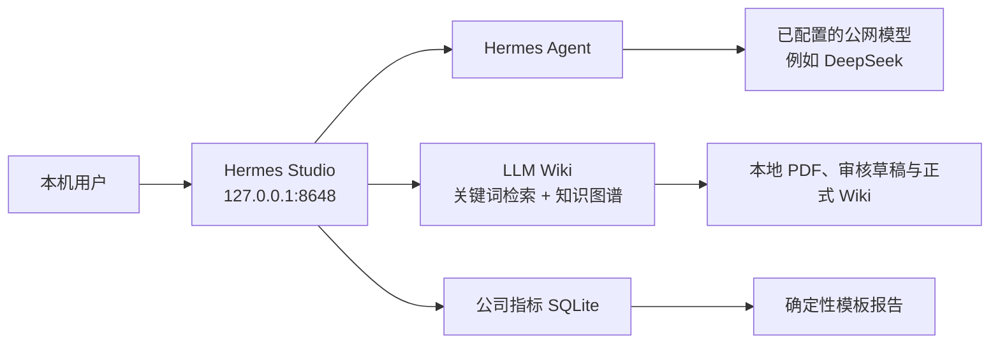

# NanWangAgent / AGNET 本地智能工作台

AGNET 是面向个人研究与日常工作的 Windows 本地智能工作台。它不重新实现 Agent 核心，而是在固定版本的 Hermes Studio、Hermes Agent 和 LLM Wiki 上增加了论文知识库、记忆管理、公司指标和定时报告能力。

本仓库交付的是 **Windows 单用户、仅限 `localhost`、非商用验证原型**。完成本 README 的首次安装后，使用者可以在本机打开 `http://127.0.0.1:8648`，上传论文、审核知识、使用 Hermes 对话、管理记忆，并查看模拟公司指标和报告。

> 不需要安装 Ollama，也不需要执行 `ollama pull bge-m3`。当前知识库固定使用 **关键词检索 + 知识图谱扩展**，不生成 embedding、不运行向量数据库或本地生成模型。

## 产品概览

| 组件 | 固定版本 | 用途 |
| --- | --- | --- |
| Hermes Agent | `0.18.2` | 对话、会话、长期记忆与工具调用运行时 |
| Hermes Studio | `0.6.30`，上游基线 `5be8548` | 本地 Web 工作台、登录、BFF 和业务页面 |
| LLM Wiki | `0.6.4`，上游基线 `03e46fc4` | PDF 解析、审核草稿、正式 Wiki、关键词检索和知识图谱 |



三类数据有明确边界：

- 论文知识只在 LLM Wiki 的审核流程中进入正式知识库；Hermes 的 `research` Profile 只能读取批准后的知识。
- 公司指标使用独立 SQLite、独立路由和确定性规则，不注册为 MCP，不会进入 Hermes、DeepSeek 或其他 LLM 上下文。
- 记忆由当前 Hermes Profile 管理；新会话可选择是否向配置的公网模型发送长期记忆。

## 功能清单

登录后默认进入“个人工作台”。左侧一级导航包括以下功能。

| 入口 | 用法 | 当前交付范围 |
| --- | --- | --- |
| 个人工作台 | 查看今日论文、待审核数、可信知识库规模、公司数据新鲜度、下一次报告和服务健康状态 | 已完成 |
| Hermes 对话 | 创建会话、选择 Profile 和记忆模式，使用已配置的模型进行对话 | 已完成；模型密钥需由使用者自行配置 |
| 个人知识库 | 上传 PDF、查看审核队列、批准或退回草稿、搜索可信知识、问答、查看待读候选和知识图谱 | 已完成；检索为关键词 + 图谱，不含向量检索 |
| 公司数据 | 手动刷新本地快照、查看指标、阈值和新鲜度 | `MockConnector` 模拟数据，不是生产经营数据 |
| 定时报告 | 查看工作日指标日报及成功/失败记录 | 已完成；周一至周五 09:00，时区为 Asia/Shanghai |
| 记忆管理 | 管理当前 Profile 的 `MEMORY.md`、`USER.md`、`SOUL.md`，查看生效状态、版本和恢复入口 | 已完成 |
| 全部功能 / 高级工具 | 原 Hermes Studio 的 History、Workflow、Jobs、Skills、MCP、Files、Coding Agents、Logs、Models 等 | 原有路由和 API 保留 |

## 数据与安全边界

### 论文知识库

论文必须经过审核才会进入可信库。状态流转如下：

```text
uploaded -> parsing -> drafting -> awaiting_review -> publishing -> trusted
                                      |                 |
                                      +-> revision_requested / rejected / failed
```

- 上传后的 PDF、AI 分析和页面变更先保存在 `.llm-wiki/staging/<draftId>`。
- `awaiting_review`、`revision_requested`、`rejected` 和 `failed` 状态的内容不会写入正式 `wiki/`、`raw/sources/`，也不会被检索、问答或 Hermes 引用。
- 批准时只允许一个草稿进入发布阶段；系统在项目锁中原子发布 PDF、Wiki 页面、索引和图谱变更，失败会回滚。
- 正式引用保留 `EvidenceLocator`，包含来源、修订、页码、章节和片段校验。界面中的页码引用可打开原 PDF 对应页。
- 本地检索优先使用已经批准、自己读过的论文。外部检索只把题录、摘要、链接和推荐理由放入“待读候选箱”，不会自动下载或进入正式 Wiki。

### Hermes 对话与记忆

新建会话时选择一种模式；第一条消息发出后该模式锁定，改用另一种模式必须新建会话。

| 模式 | 行为 | 适用场景 |
| --- | --- | --- |
| 开启长期记忆（`on`） | Hermes 标准记忆行为。`MEMORY.md` 和 `USER.md` 会作为上下文发送给当前配置的公网模型。 | 非敏感的稳定偏好、长期研究背景 |
| 关闭长期记忆（`clean`） | 使用 `skip_memory=True`；不读取或发送 `MEMORY.md`、`USER.md`，不加载 memory 工具、外部 Memory Provider 或 `session_search`。 | 临时、敏感或不希望使用长期偏好的会话 |

`SOUL.md`、用户选择的 Skills 和当前工作区上下文会在两种模式下保留。请只把非敏感偏好和稳定事实写入 `MEMORY.md` / `USER.md`，不要写入密码、密钥、身份证号、客户数据或公司经营数据。

### 公司数据

- 指标数据库为独立的 `company-metrics.sqlite`，不属于 Hermes Profile，也不会发送给 LLM。
- 首期提供 `MockConnector` 和 3-5 个可配置模拟指标，支持当前值、单位、方向、口径版本、阈值、源数据时间、请求 ID 和刷新时间。
- 异常完全由上下限、环比阈值和连续异常规则判定；报告由确定性模板生成，不调用 LLM。
- Windows 登录并注册任务后，工作日 09:00 会采集并生成报告。09:00 后首次启动时，当天没有报告则只补跑一次；同一 `reportDate` 不会重复生成。
- 接入真实平台前，必须提供 API 文档、鉴权方式、指标口径和阈值，并完成权限、脱敏和审计评审。

## 安装前准备

### 系统要求

- Windows 10 或 Windows 11 x64，PowerShell 5.1 或更高版本。
- Node.js `>= 23`，推荐 Node.js 24 LTS；安装后 `node --version` 必须返回 `v23` 或更高。
- `pnpm`，可通过 `npm install --global pnpm` 安装。
- Python 和 `py` Launcher，用于创建项目独立的 Hermes 虚拟环境。
- Rust stable、Visual Studio C++ Build Tools（勾选“使用 C++ 的桌面开发”）和 Microsoft Edge WebView2 Runtime，用于构建 LLM Wiki Tauri 桌面程序。
- Git，以及访问 npm、PyPI 和 Rust 依赖源的网络。

建议安装完成后在新的 PowerShell 窗口中确认：

```powershell
node --version
npm --version
pnpm --version
py --version
rustc --version
```

Ollama、GPU、CUDA、`bge-m3` 都不在本项目的依赖列表中。只有 CPU 的 Windows 机器可以运行当前模式；PDF 数量较多时，解析和图谱更新会受 CPU、内存和磁盘性能影响。

### 获取代码

使用 Git：

```powershell
git clone https://github.com/feifeidu-max/NanWangAgent.git
Set-Location .\NanWangAgent
git checkout main
```

也可以解压交付的源码包后，在仓库根目录打开 PowerShell。以下所有命令均以仓库根目录为工作目录。

## 首次安装

下面的步骤只需在一台新机器上执行一次。不会下载或安装 Ollama。

### 1. 安装固定版本的 Hermes Agent

将 Hermes 安装在仓库自己的虚拟环境中，避免覆盖机器上已有的其他 Hermes 版本：

```powershell
$hermesVenv = Join-Path $PWD ".runtime\hermes-0.18.2"
py -m venv $hermesVenv
& "$hermesVenv\Scripts\python.exe" -m pip install --upgrade "hermes-agent==0.18.2"
& "$hermesVenv\Scripts\hermes.exe" --version
```

最后一条命令必须显示 `0.18.2`。

### 2. 安装并构建 Hermes Studio

```powershell
Set-Location .\apps\hermes-studio
pnpm install --frozen-lockfile
pnpm run build
Set-Location ..\..
```

### 3. 安装并构建 LLM Wiki

```powershell
Set-Location .\apps\llm-wiki
npm ci
npm run tauri build
Set-Location ..\..
```

成功后，默认可执行文件位于：

```text
apps\llm-wiki\src-tauri\target\release\llm-wiki.exe
```

Tauri 首次构建通常需要数分钟，并会下载 Rust/Windows 依赖。如果构建报错，先确认 Rust、Visual Studio C++ Build Tools 和 WebView2 Runtime 均已安装，再重新执行该命令。不要把旧版本的 LLM Wiki 可执行文件当作本仓库的构建产物使用。

### 4. 创建本机配置

复制模板；该文件已经被 Git 忽略，不能提交：

```powershell
Copy-Item .\ops\config.example.psd1 .\ops\config.local.psd1
notepad .\ops\config.local.psd1
```

至少检查或修改以下字段。路径可以是绝对路径，也可以是相对于仓库根目录的路径。仓库位于中文目录时，建议使用下面的相对路径，避免旧版 PowerShell 的编码/路径兼容问题。

```powershell
@{
    HermesExecutable  = ".runtime\hermes-0.18.2\Scripts\hermes.exe"
    LlmWikiExecutable = "apps\llm-wiki\src-tauri\target\release\llm-wiki.exe"

    # 必须与稍后在 LLM Wiki 中创建或选中的项目一致。
    WikiProjectPaths = @(
        "%USERPROFILE%\Documents\LLM-Wiki"
    )

    # 确保该盘可写、有足够空间，且不位于 Wiki 项目或 Hermes 数据目录内。
    BackupRoot      = "D:\AGNET-Backups"
    RetentionCount  = 30
    DailyBackupTime = "18:00"
}
```

保留模板中其他配置项不变即可。`HermesHome` 留空时，Studio 按 Windows 默认位置自动发现；`CompanyMetricsDbPath` 留空时，使用 Studio 数据目录中的独立 `company-metrics.sqlite`。

### 5. 创建 LLM Wiki API Token

Token 仅写入当前 Windows 用户环境变量，**不要**写进 `config.local.psd1`、`.env`、聊天、Wiki、日志或 README。以下命令会生成 32 字节随机 Token，并同时写入当前 PowerShell：

```powershell
$bytes = New-Object byte[] 32
$rng = [Security.Cryptography.RandomNumberGenerator]::Create()
$rng.GetBytes($bytes)
$rng.Dispose()
$token = [Convert]::ToBase64String($bytes)
[Environment]::SetEnvironmentVariable("AGNET_LLM_WIKI_API_TOKEN", $token, "User")
$env:AGNET_LLM_WIKI_API_TOKEN = $token
Remove-Variable token, bytes
```

关闭并重新打开 PowerShell 后，用户环境变量会自动生效。启动器会把它临时映射为 LLM Wiki 所需的 `LLM_WIKI_API_TOKEN`，并只传给 LLM Wiki MCP 子进程。

### 6. 首次配置 LLM Wiki 桌面程序

在同一个 PowerShell 中先让桌面程序继承 Token：

```powershell
$env:LLM_WIKI_API_TOKEN = $env:AGNET_LLM_WIKI_API_TOKEN
Start-Process .\apps\llm-wiki\src-tauri\target\release\llm-wiki.exe
```

在 LLM Wiki 桌面窗口完成以下一次性操作：

1. 创建或选择个人知识库项目，例如 `%USERPROFILE%\Documents\LLM-Wiki`。该目录必须与 `config.local.psd1` 的 `WikiProjectPaths` 完全一致，且建议只配置一个现有项目。
2. 打开“设置”中的 **API + MCP** 区域，开启“本地 HTTP API”和“启用 MCP 访问”。
3. 保持“允许无 Token 访问”关闭，并保持“允许 API 和 Clip server 局域网访问”关闭。
4. 保存设置。若显示 `LLM_WIKI_API_TOKEN` 已生效，说明桌面程序正在使用环境变量中的 Token；不要把 Token 复制到其他文件。
5. 在 LLM Wiki 的模型/Provider 设置中配置获批准的论文处理模型端点（例如 DeepSeek 兼容端点）。论文生成草稿和 Wiki 问答需要模型凭据；凭据不随本仓库交付。

完成后可退出 LLM Wiki，之后由 `Start-AGNET.cmd` 统一启动。若启动器发现刚好有一个已存在的 `WikiProjectPaths`，会自动将它设为当前项目；否则需要先在 LLM Wiki 中手动选中项目。

### 7. 启动工作台并完成首次登录

```powershell
.\Start-AGNET.cmd
```

启动器会依次：校验版本、初始化 `research` Profile、启动 LLM Wiki、检查 Token 和回环监听、启动 Studio，然后打开：

```text
http://127.0.0.1:8648
```

首次账户为 `admin / 123456`。首次登录必须按页面提示修改默认密码；不要在共享机器上保留默认密码。登录会话有效期固定为 12 小时。

### 8. 配置 Hermes 对话模型

本仓库不会附带 DeepSeek 或任何公网模型的 Key。登录后从“全部功能 / 高级工具”进入 Models/Providers，按照组织批准的模型端点配置模型和凭据。对话、Wiki 草稿生成和 Wiki 问答在没有可用模型时不能生成内容，但本地工作台、审核队列、关键词检索、图谱和公司模拟指标仍可正常打开。

## 每日使用指南

### 论文入库与审核

1. 打开“个人知识库”，在上传区选择一篇或多篇原生 PDF。
2. 等待处理状态依次经过解析、草稿和待审核。重复 PDF 由 SHA-256 识别，不会重复入库。
3. 在“审核队列”中查看摘要、拟新增/修改页面、页面差异和证据定位。
4. 根据内容选择“批准”、“退回重做”或“拒绝”。只有批准后的论文才进入可信库。
5. 在“已入库/可信知识”中用关键词搜索，并从“知识图谱”查看主题及论文关系。
6. 在 Wiki 问答中提问。回答优先使用已批准的本地 Wiki；本地证据不足时，外部结果只会进入“待读候选箱”，需要自行阅读并手动上传 PDF 才能入库。

建议先审核再引用。这样 Hermes 优先检索自己已经阅读、理解并确认过的内容，而不是每次从互联网上临时找陌生论文。

### 在 Hermes 中引用自己的知识

1. 新建 Hermes 会话，在 Profile 选择 `research`。
2. 使用 `research` Profile 提问研究问题。它只有 LLM Wiki 的 `search`、`read`、`graph` 三个只读工具。
3. Hermes 会先搜索已批准 Wiki；回答中的事实性结论应带有类似 `【作者, 年份, p.N】` 的页码引用。
4. 点击引用可通过本地受鉴权的 PDF Range 接口打开对应页。

`research` Profile 不提供 Wiki 写入、终端、文件写入、公司数据或其他 MCP 工具。论文写入只能从知识库页面进入审核流程。

### 管理记忆

1. 新建会话时，在首条消息前选择“开启长期记忆”或“关闭长期记忆”。
2. 会话顶部会持续显示当前模式。发出首条消息后不能切换；需要不同边界时创建新会话。
3. 打开“记忆管理”，选择当前 Profile 的 `MEMORY.md`、`USER.md` 或 `SOUL.md`。
4. 保存时使用版本校验和原子写入；可查看 Markdown 预览、真实路径、更新时间、字符预算和历史版本，并恢复旧版本。

对公网模型使用 `on` 模式前，确认记忆文件不含敏感信息。`clean` 不是匿名网络模式，它只保证不加载长期记忆；当前会话输入、`SOUL.md` 和工作区上下文仍会发送给你选择的模型端点。

### 查看公司数据与报告

1. 打开“公司数据”，点击“手动刷新”以采集当前模拟快照。
2. 查看各指标的当前值、时间、阈值和异常状态；旧数据不会伪装成当天数据。
3. 打开“定时报告”查看历史日报。工作日 09:00 会生成新报告；若采集失败，页面会留下失败记录而不是复用旧报告。

当前内容是模拟连接器演示。不要把公司生产数据、浏览器 Cookie、通用 SQL 账号或经营报表粘贴到 Hermes、LLM Wiki 或模型配置中。

## 日常运维

### 启动、停止和健康检查

启动：

```powershell
.\Start-AGNET.cmd
```

停止 Studio：

```powershell
node .\apps\hermes-studio\bin\hermes-web-ui.mjs stop
```

LLM Wiki 是独立桌面/托盘进程；停止 Studio 后，在系统托盘中退出 LLM Wiki。常用健康检查：

```powershell
Invoke-RestMethod http://127.0.0.1:8648/health
Invoke-RestMethod http://127.0.0.1:19828/api/v1/health
Get-NetTCPConnection -State Listen | Where-Object LocalPort -in 8648,19828,19827,8642
```

所有服务必须只监听 `127.0.0.1` 或 `::1`。启动器检测到局域网监听会停止启动，避免把论文和本机 API 暴露到网络中。

### 自动启动、备份与恢复

注册当前 Windows 用户的登录自启和每日备份任务：

```powershell
.\ops\Register-AGNETTasks.ps1
```

默认每天 `18:00` 备份到 `D:\AGNET-Backups`，保留 30 份。任务只在该用户有交互式登录令牌时运行。取消注册：

```powershell
.\ops\Register-AGNETTasks.ps1 -Unregister
```

手动备份：

```powershell
.\ops\Backup-AGNET.ps1
```

备份包括 Hermes Profile/会话、Studio 会话数据库、记忆版本、Skills、Wiki 原文/正式页/审核状态和公司指标数据库。`.env`、Token、认证 JSON、私钥和其他凭据类文件会被排除；扫描到疑似明文 API Key 时备份会失败而不是带出密钥。

恢复前先退出 Studio 和 LLM Wiki，再执行：

```powershell
.\ops\Restore-AGNET.ps1 `
  -BackupPath "D:\AGNET-Backups\20260718T180000" `
  -ConfirmRestore `
  -Overwrite
```

恢复脚本会验证清单、SHA-256、SQLite 完整性和路径边界。恢复后重新运行 `Start-AGNET.cmd` 并抽查一条会话、一篇论文和一份报告。

## 验证与验收

当前开发机已完成 100 篇本地已有学术 PDF 的流程级验证：100 篇均达到 `trusted`，关键词检索返回结果正常，图谱为 103 个节点/100 条关系，PDF Range 和页码证据可用。原始 PDF 因体积和版权原因不随仓库分发。

验证报告位于 [validation/knowledge-flow-report.json](validation/knowledge-flow-report.json)。若你拥有单独授权的、恰好 100 篇测试 PDF，可运行流程回归：

```powershell
.\validation\run-knowledge-flow.ps1 `
  -ProjectPath "$env:USERPROFILE\Documents\LLM-Wiki" `
  -PaperDirectory "D:\your-validated-100-pdfs" `
  -LlmWikiExecutable ".\apps\llm-wiki\src-tauri\target\debug\llm-wiki.exe"
```

该脚本仅用于开发/验收，需要恰好 100 个 PDF、可用 API Token、已创建的 Wiki 项目和 debug 可执行文件；不是首次启动的必经步骤。它会写入 `validation/knowledge-flow-report.json`。

## 常见问题

### 启动器提示 Hermes 或 Node 版本不匹配

检查版本：

```powershell
node --version
.\.runtime\hermes-0.18.2\Scripts\hermes.exe --version
```

Node 必须为 23 或更高，Hermes 必须为 `0.18.2`。确认 `config.local.psd1` 中的 `HermesExecutable` 指向仓库内 `.runtime`，而不是系统中旧的 `hermes.exe`。

### 提示 LLM Wiki Token 缺失、API 未开启或返回 401

重新打开 PowerShell，确认用户环境变量存在：

```powershell
[Environment]::GetEnvironmentVariable("AGNET_LLM_WIKI_API_TOKEN", "User")
```

然后在 LLM Wiki 设置的“API + MCP”中确认：本地 HTTP API 已开启、MCP 已开启、匿名访问关闭、LAN 访问关闭。不要把 Token 加到 URL 查询参数中，因为 URL 会进入浏览器历史和日志。

### 提示没有当前 Wiki 项目，或项目没有备份

在 LLM Wiki 中选择或创建项目，并让其路径与 `WikiProjectPaths` 逐字匹配。建议首次交付时只保留一个存在的项目路径，启动器即可自动选择它；任何需要备份的项目都必须列在该数组中。

### 端口已被占用

检查占用进程：

```powershell
Get-NetTCPConnection -State Listen | Where-Object LocalPort -in 8648,19828,19827,8642 | Select-Object LocalAddress,LocalPort,OwningProcess
```

先关闭旧的 Studio/LLM Wiki 进程，再重新运行启动器。不要通过开启 LAN 访问来规避端口问题。

### 为什么系统没有安装 Ollama / bge-m3

这是产品设计选择，而不是缺失依赖。当前版本用词法关键词和知识图谱做本地检索，能在 CPU 机器运行，并避免 embedding 模型下载、GPU 依赖和向量索引维护。若未来改回向量检索，需要重新设计数据迁移、索引重建和验收标准，不能直接在本机随意安装模型后混用。

### Studio 能打开，但对话或论文草稿不能生成

这通常表示尚未配置获批准的模型端点或凭据。请分别检查 Studio 的 Models/Providers 和 LLM Wiki 的模型设置；模型 Key 不包含在仓库或备份中。公司数据不能作为测试提示词发送到公网模型。

## 交付与限制

交付给另一位使用者时，建议提供：

- 本仓库源码及本 README；不要提供你的 `ops/config.local.psd1`、`.env`、用户环境变量、Hermes Home、Studio 数据库、论文原文或备份目录。
- 使用者自己的 LLM Wiki 项目目录和有权使用的论文 PDF；论文版权、个人数据和模型密钥由使用者负责。
- 本 README 中的首次安装步骤，以及经批准的模型端点和公司 API 接入流程（如适用）。

当前版本的已知范围：

- 是单用户、本机回环地址、非商用验证原型，不支持多用户、局域网访问或生产服务托管。
- 不随仓库提供 DeepSeek/API Key；需要使用者在本机配置获批准的模型端点。
- 公司数据只实现 `MockConnector`。真实连接器、实际经营数据和法定节假日调休尚未交付。
- 100 篇 PDF 已做流程验证，但 50 个研究问题的检索质量、Top 5 命中率和引用质量验收仍需由实际领域数据完成。
- LLM Wiki 的当前流程验证使用最新 debug 构建；正式对外分发前，应在目标机器完成一次成功的 Tauri release 构建，并用 release 可执行文件重新检查 `/api/v1/health` 中的 `retrievalMode=keyword_graph`。

更完整的构建、运维和验收记录见：

- [Windows 安装与运行手册](docs/SETUP-WINDOWS.md)
- [交付与验收状态](docs/DELIVERY-STATUS.md)
- [产品需求与实现基线](plan.md)
- [许可证边界与部署门禁](docs/LICENSE-BOUNDARIES.md)

## 许可证与使用门禁

- Hermes Agent 使用 MIT 许可证。
- Hermes Studio 使用 BSL-1.1；在商业使用、公司内部正式使用、SaaS、真实经营数据接入或部门部署前，需要取得 EKKOLearnAI 商业授权或法务书面意见。
- LLM Wiki 使用 GPL-3.0-only，并以独立源码、独立进程和独立构建物运行。向组织外分发修改后的 LLM Wiki 二进制时，必须按 GPL-3.0 提供对应源码、构建说明、许可证和修改声明。

本 README 是工程交付说明，不构成法律、安全或数据合规意见。正式扩大使用范围前，应完成模型端点批准、真实 API 权限审计、安全审计、备份恢复演练和许可证评审。
